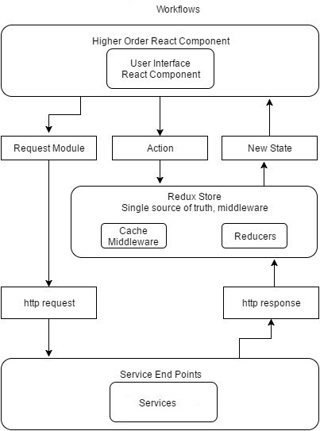

# MobileRN App

This is the repository of the MobileRN application version 1. In this application we follow a singleton index Redux Architecture.

/index.js :
It is the default entry point of every react-native application. There are no changes in this file at all.

/Src/… :
All the resources generated by the team for our application must reside within this directory.
This will be the core application source code.
“/App.js” file is the container of our app and served as the entry point

/assets :
As the name suggests, all the static assets should reside here.
Each asset should be registered and exported from the /index.js
Thus, all assets will be accessible and imported from ‘/assets’

/components :
Only shared components used across features are placed here.
All the components should be registered and exported from /index.js for a single access point.
All the components should bear named export. This will avoid any conflicts.
Components that consist of complex logic or redux integration, can be further de-structured into “ComponentContainer.js” & “ComponentView.js” as per the “Container-View pattern” (this will be covered ahead in /screens or page part)

/containers :
This is the heart of our application.
All the various features/screens/pages are defined here. In this case, login, onBoarding and home are 3 different screens of this app.
Each screen consists of an index.js file which exports the screen’s container as default module which makes the screen available to be utilised as a component.

/i18n :
Internationalisation or multi-lingual support is achieved by the use of the “i18n” library.
It mainly consists of a configuration file and all the language translations in independent language.json files.

/navigation :
As the name suggests, all the routing logic resides here.
This app contains only one stack of navigation. Although, most of the apps will have minimum 2 navigators; viz before and after authentication.
Ideally, all different navigators should be re-factored in separate files and then used in “Navigator.js”.
ROUTES.js consists of all the constants for various available routes within our app.
/components directory will hold all the navigation specific components like headers, title bars, action buttons, like so.

/redux :
It holds all the redux resources at one place.
This includes action creators, reducers and store of our app.
/redux/action has all the action types.
redux/action consist of all the action-creators. Considering the demo app, there is only 1 action-creator, it can be broken into multiple files and can be into distributed locations feature/screen wise.
/redux/reducer reduces all the actions to store. Same applies for reducers. For a wider scope of app, this can become an app level root-reducer which merges various feature-level reducers using redux’s combineReducers function.
/store is the central store of the application. This incorporates all the mapping between reducer, store and middle-wares if any.
We have a redux-saga middleware in our app for enabling asynchronous dispatching of actions.

/network :
network are to manage all api requests. You can see them as a bridge/an adapter between the server API and the view layer (scenes and components) of your application.
It can take care of network calls your app will make, get and post content, and transform payloads as needed before being sent or saved in the store of your app (such as Redux and redux-saga).
The screens and components will only dispatch actions, read the store and update themselves based on the new changes.
Actions will use services. Saga is a redux middleware used to handle asynchronous actions and side-effects.
You can use fetch for REST API calls in your service handlers.

/utils :
All the utility/helper methods, validations, etc that can be shared across our entire project are added here.

/styles :
This module holds our application-level styles.
It can include theme definition (font, colours, typography) of the app UI, and global styles.
Which are then referenced in individual components using React Native’s multiple-style syntax.

/\_\_tests\_\_ :
Jest framework is default supported by react for unit testing the application.
All the unit test files are placed inside “\*\*tests\*\*” dir alongside the corresponding .js files.
It can be components, miscellaneous functions, containers, or like so.

- Architecture flow
- React-Navigation (Stack & Bottom navigation)
- Redux (Actions & Reducer)
- Redux-saga
- Redux persist
- Common Screens (Components and Container)
- Common Components (Input, Button, Radio, Checkbox, DropDown etc.)
- Utils (Color, String, styles)
- Network Wrapper
- APIs
- Environment setup
- Localize Setup (EN & AR)
- Asset & Font setup

# Getting Started

If you want to run the application on your local machine you have to setup the environment for react-native development. For this setup please follow the offical webiste: [Install React-Native CLI](https://reactnative.dev/docs/environment-setup)

# Features / Components

Uses React 18.0.0
Uses React Native 0.69.0

For checkout: `git clone https://github.com/narsinghtomar/mobileRn.git

After successful setting up react native and cloning this repository you can run `npx react-native run-ios` for IOS and `npx react-native run-Android` for Android to start the application on a simulator / emulator.

`yarn install`
`react-native run-ios`
`react-native run-android`

# Scripts

$ npm start - Starts the react native package manager
$ npm test - Executes tests and prepares code coverage report
$ npm run lint - Lints the code using ESLint with the popular airbnb config

Before pushing code to the repository, the developers should run a script `yarn lint` and `yarn test` that makes sure that they don't have lint issues. The same script also generates a code coverage report.

The code coverage report can be found at coverage/index.html. Developers should ensure that they have full code coverage, by analyzing the code coverage report and only after that, they should commit the code.

# Android Build

cd android
#Clean build:
./gradlew clean

#Create debug build:
$ ./gradlew assembleDebug

#Create apk release build:
$ ./gradlew assembleRelease

#Create Bundle release build:
./gradlew bundleRelease

# Testing

The project currently contains unit-tests for the components, at same path with name suffixed .test.js.

Run npm test to execute these tests. This will generate a coverage report under coverage folder. To view this report open coverage -> lcov-report and click on index.html.

# App Screens (Displays articles from NY Times)

